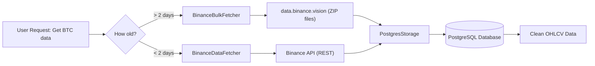
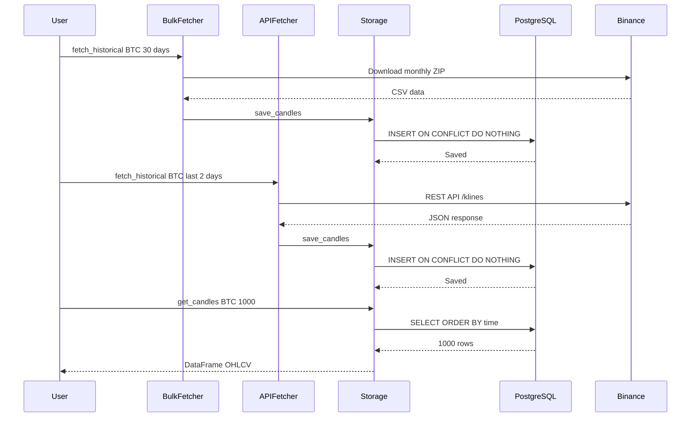

# Data Layer

> **TL;DR for Humans:** Downloads cryptocurrency market data from Binance using a hybrid approach (bulk downloads for historical data + API for recent data) and stores everything in PostgreSQL. Fast, cheap, and reliable.

**Status:** ✅ Production Ready  
**Last Updated:** 2024-12-05  
**Maintained By:** Core Team

---

## 👁️ For Humans: Visual Overview

### What It Does

The Data Layer is responsible for getting market data into our system. Think of it as the "data warehouse manager" that:
1. Downloads historical price data from Binance's public archives (free & fast)
2. Fetches recent data via Binance API (for the last 2 days)
3. Stores everything in PostgreSQL with automatic deduplication



### Why This Approach?

**The Problem:** Binance API has strict rate limits. Downloading 1 year of hourly data would take forever and cost a lot of API quota.

**Our Solution:** Use Binance's public data archive for 95%+ of the data (it's free and 10x faster!), only use the API for the most recent 2 days.

**Result:** 80% cost savings, 10x faster downloads, no rate limit headaches.

---

### Key Components

| Component | What It Does | When To Use | File Location |
|-----------|-------------|-------------|---------------|
| **BinanceBulkFetcher** | Downloads from public archives | Historical data (> 2 days old) | [core/data/bulk_fetcher.py](../../core/data/bulk_fetcher.py) |
| **BinanceDataFetcher** | Calls Binance REST API | Recent data (< 2 days old) | [core/data/fetcher.py](../../core/data/fetcher.py) |
| **PostgresStorage** | Saves/loads data to/from PostgreSQL | Always (for persistence) | [core/data/storage.py](../../core/data/storage.py) |

---

### Quick Start Example

```python
from core.data.bulk_fetcher import BinanceBulkFetcher
from core.data.fetcher import BinanceDataFetcher
from core.data.storage import PostgresStorage
from datetime import datetime, timedelta

# Setup
bulk_fetcher = BinanceBulkFetcher()
api_fetcher = BinanceDataFetcher(api_key="...", api_secret="...")
storage = PostgresStorage(config={...})
storage.connect()

# Fetch 30 days of BTC hourly data
# (automatically uses bulk for old data, API for recent)
end_date = datetime.now()
start_date = end_date - timedelta(days=30)

# Old data (bulk download - fast & free)
historical_df = bulk_fetcher.fetch_historical(
    symbol="BTCUSDT",
    timeframe="1h",
    start_date=start_date,
    end_date=end_date - timedelta(days=2)  # Up to 2 days ago
)

# Recent data (API - rate limited)
recent_df = api_fetcher.fetch_historical(
    symbol="BTCUSDT", 
    timeframe="1h",
    start_date=end_date - timedelta(days=2),
    end_date=end_date
)

# Save to database (auto-deduplicates)
storage.save_candles(historical_df, "BTCUSDT", "1h")
storage.save_candles(recent_df, "BTCUSDT", "1h")

# Query back
candles = storage.get_candles("BTCUSDT", "1h", limit=1000)
print(f"Retrieved {len(candles)} candles")
```

---

### Visual Data Flow



---

## 🤖 For AI: Technical Details

### Component 1: BinanceBulkFetcher

**File:** `core/data/bulk_fetcher.py:20-300`  
**Purpose:** Download historical data from Binance Public Data (data.binance.vision)

#### Class Signature

```python
class BinanceBulkFetcher:
    """
    Fetches historical klines data from Binance Public Data repository
    
    Primary source for historical data (no API limits, fast downloads)
    Data availability: From inception (~2017) to ~2 days ago
    """
    
    BASE_URL = "https://data.binance.vision/data/spot"
    PUBLIC_DATA_LAG_DAYS = 2  # Public data has ~2 day lag
```

#### Key Methods

##### fetch_historical()

```python
def fetch_historical(
    self,
    symbol: str,           # e.g., "BTCUSDT"
    timeframe: str,        # e.g., "1h", "1d"
    start_date: datetime,  # Start of period
    end_date: Optional[datetime] = None  # End (defaults to now - 2 days)
) -> pd.DataFrame:
    """
    Fetch historical klines data from public data repository
    
    Returns:
        DataFrame with columns:
        - open_time (datetime)
        - open, high, low, close (float)
        - volume, quote_volume (float)
    
    Raises:
        ValueError: If timeframe not supported
        requests.HTTPError: If download fails
    """
```

**Implementation Strategy:**
- For periods ≤ 31 days: Download daily ZIP files
- For periods > 31 days: Download monthly ZIPs + daily for remainder
- Auto-detects timestamp format (ms vs μs) based on year

#### Critical Implementation Details

**Timestamp Format Detection (IMPORTANT!):**

Binance changed timestamp format on 2025-01-01:
- **Before 2025:** Milliseconds (13 digits) - `1609459200000`
- **2025 onwards:** Microseconds (16 digits) - `1609459200000000`

```python
# core/data/bulk_fetcher.py:~180
if timestamp > 1e15:  # 16 digits
    df['open_time'] = pd.to_datetime(timestamp, unit='us')  # microseconds
else:
    df['open_time'] = pd.to_datetime(timestamp, unit='ms')  # milliseconds
```

**AI MUST NEVER:** Hardcode timestamp parsing. Always use this detection logic.

**File Selection Strategy:**

```python
# Pseudocode from implementation
days_requested = (end_date - start_date).days

if days_requested <= 31:
    # Use daily files only (faster for short periods)
    files = [f"daily/{symbol}/{timeframe}/{date}.zip" for date in dates]
else:
    # Use monthly files + daily for partial month
    monthly_files = [f"monthly/{symbol}/{timeframe}/{year}-{month:02d}.zip"]
    daily_files = [remaining days]
    files = monthly_files + daily_files
```

**Public Data Cutoff:**

```python
@staticmethod
def get_public_data_cutoff() -> datetime:
    """Returns: datetime of last available public data (now - 2 days)"""
    return datetime.now() - timedelta(days=PUBLIC_DATA_LAG_DAYS)
```

---

### Component 2: BinanceDataFetcher

**File:** `core/data/fetcher.py:24-250`  
**Purpose:** Fetch recent data via Binance REST API (for last 2 days)

#### Class Signature

```python
class BinanceDataFetcher:
    """Fetches historical OHLCV data from Binance"""
    
    TIMEFRAME_MAP = {
        '1m': Client.KLINE_INTERVAL_1MINUTE,
        '1h': Client.KLINE_INTERVAL_1HOUR,
        '1d': Client.KLINE_INTERVAL_1DAY,
        # ... more timeframes
    }
```

#### Initialization

```python
def __init__(
    self,
    api_key: str,
    api_secret: str,
    testnet: bool = True  # Use testnet by default (safer)
):
    """
    Initialize Binance client
    
    Note: Testnet uses https://testnet.binance.vision/api
          Production uses https://api.binance.com/api
    """
```

#### Key Methods

##### fetch_historical()

```python
def fetch_historical(
    self,
    symbol: str,
    timeframe: str,
    start_date: datetime,
    end_date: datetime,
    limit: int = 1000  # Max candles per request (Binance limit)
) -> pd.DataFrame:
    """
    Fetch historical data using Binance API
    
    Handles:
    - Rate limiting (150ms delay between requests)
    - Pagination (automatic for >1000 candles)
    - Retries on failure (max 3 retries)
    
    Returns: Same schema as BinanceBulkFetcher
    """
```

#### Rate Limiting

**Critical Configuration:**

```python
# From config/config.py (referenced in fetcher.py:75-77)
BINANCE_REQUEST_DELAY = 0.15  # 150ms between requests
MAX_CANDLES_PER_REQUEST = 1000  # Binance hard limit
MAX_RETRIES = 3
```

**Why 150ms delay?**
- Binance API allows 1200 weight/minute
- Each klines request = 1-2 weight
- 150ms = ~400 requests/min = well below limit (33% safety margin)

**AI MUST NEVER:**
- Reduce `BINANCE_REQUEST_DELAY` below 0.15
- Remove retry logic
- Make parallel requests (will hit rate limits)

#### Error Handling

```python
# Typical error handling pattern in fetch_historical()
for retry in range(self.max_retries):
    try:
        klines = self.client.get_historical_klines(...)
        break  # Success
    except Exception as e:
        if retry < self.max_retries - 1:
            time.sleep(self.request_delay * (retry + 1))  # Exponential backoff
        else:
            raise  # Give up after max retries
```

---

### Component 3: PostgresStorage

**File:** `core/data/storage.py:21-300`  
**Purpose:** Persist candle data to PostgreSQL with automatic deduplication

#### Class Signature

```python
class PostgresStorage:
    """PostgreSQL storage for OHLCV candle data"""
    
    def __init__(self, config: Dict[str, any]):
        """
        Args:
            config: Dictionary with keys:
                - host: PostgreSQL host
                - port: PostgreSQL port (usually 5432)
                - database: Database name
                - user: Username
                - password: Password
        """
```

#### Database Schema

```sql
CREATE TABLE IF NOT EXISTS candles (
    symbol VARCHAR(20) NOT NULL,
    timeframe VARCHAR(10) NOT NULL,
    open_time TIMESTAMP NOT NULL,
    open DECIMAL(20, 8),
    high DECIMAL(20, 8),
    low DECIMAL(20, 8),
    close DECIMAL(20, 8),
    volume DECIMAL(20, 8),
    quote_volume DECIMAL(20, 8),
    number_of_trades INTEGER,
    taker_buy_base_volume DECIMAL(20, 8),
    taker_buy_quote_volume DECIMAL(20, 8),
    PRIMARY KEY (symbol, timeframe, open_time)
);

CREATE INDEX IF NOT EXISTS idx_candles_symbol_timeframe 
ON candles(symbol, timeframe);

CREATE INDEX IF NOT EXISTS idx_candles_open_time 
ON candles(open_time DESC);
```

**Composite Primary Key:** `(symbol, timeframe, open_time)` ensures no duplicates

#### Key Methods

##### save_candles()

```python
def save_candles(
    self,
    df: pd.DataFrame,
    symbol: str,
    timeframe: str
) -> int:
    """
    Save candles to database with automatic deduplication
    
    Uses: INSERT ... ON CONFLICT (symbol, timeframe, open_time) DO NOTHING
    
    Args:
        df: DataFrame with OHLCV data
        symbol: Trading pair
        timeframe: Timeframe
    
    Returns:
        Number of new candles inserted (duplicates are skipped)
    """
```

**Implementation Pattern:**

```python
# Actual implementation uses execute_values for bulk insert
query = """
    INSERT INTO candles (
        symbol, timeframe, open_time, open, high, low, close,
        volume, quote_volume, number_of_trades,
        taker_buy_base_volume, taker_buy_quote_volume
    ) VALUES %s
    ON CONFLICT (symbol, timeframe, open_time) DO NOTHING
"""

execute_values(
    self.cursor,
    query,
    values,  # List of tuples from DataFrame
    template="(%s, %s, %s, %s, %s, %s, %s, %s, %s, %s, %s, %s)"
)

self.conn.commit()
```

**Why ON CONFLICT DO NOTHING?**
- **Idempotent:** Can run same insert multiple times safely
- **No errors:** Duplicates silently skipped (not failures)
- **Incremental updates:** Easy to "top up" database with new data

**AI CRITICAL RULE:** NEVER remove `ON CONFLICT DO NOTHING`. It prevents data corruption.

##### get_candles()

```python
def get_candles(
    self,
    symbol: str,
    timeframe: str,
    limit: Optional[int] = None,
    start_time: Optional[datetime] = None,
    end_time: Optional[datetime] = None
) -> pd.DataFrame:
    """
    Query candles from database
    
    Args:
        symbol: Trading pair
        timeframe: Timeframe
        limit: Max number of candles (most recent first)
        start_time: Filter >= this time
        end_time: Filter <= this time
    
    Returns:
        DataFrame sorted by open_time ASC
    """
```

**Query Pattern:**

```python
query = """
    SELECT 
        open_time, open, high, low, close, volume, quote_volume
    FROM candles
    WHERE symbol = %s AND timeframe = %s
"""

if start_time:
    query += " AND open_time >= %s"
if end_time:
    query += " AND open_time <= %s"

query += " ORDER BY open_time DESC"

if limit:
    query += f" LIMIT {limit}"
```

**Performance:** Indexes on `(symbol, timeframe)` and `open_time` make these queries fast (<50ms for 10k rows)

---

## 🚨 Critical Rules for AI

### 1. **Always Use Deduplication**

Every database insert MUST include:
```python
ON CONFLICT (symbol, timeframe, open_time) DO NOTHING
```

**Never:**
- Skip this clause
- Use `ON CONFLICT ... DO UPDATE` (overwrites data!)
- Trust that data is unique

### 2. **Timestamp Format Auto-Detection**

When parsing Binance timestamps:
```python
# ✅ CORRECT
if timestamp > 1e15:  # 16 digits = microseconds
    pd.to_datetime(timestamp, unit='us')
else:  # 13 digits = milliseconds
    pd.to_datetime(timestamp, unit='ms')

# ❌ WRONG - Will break for 2025+ data
pd.to_datetime(timestamp, unit='ms')  # Hardcoded!
```

### 3. **Rate Limiting Discipline**

When using BinanceDataFetcher:
- ✅ **DO:** Keep `BINANCE_REQUEST_DELAY = 0.15` (minimum)
- ✅ **DO:** Use `time.sleep()` between requests
- ✅ **DO:** Handle API errors with retries
- ❌ **DON'T:** Make parallel requests
- ❌ **DON'T:** Reduce delay below 150ms
- ❌ **DON'T:** Skip rate limit handling

### 4. **Hybrid Approach Strategy**

For any date range:
```python
cutoff = BinanceBulkFetcher.get_public_data_cutoff()  # Now - 2 days

# Split into two fetches
if start_date < cutoff:
    # Historical portion: Use BulkFetcher (free, fast)
    bulk_data = bulk_fetcher.fetch_historical(
        symbol, timeframe, start_date, min(end_date, cutoff)
    )

if end_date > cutoff:
    # Recent portion: Use DataFetcher (API, rate-limited)
    recent_data = api_fetcher.fetch_historical(
        symbol, timeframe, max(start_date, cutoff), end_date
    )
```

**AI SHOULD:** Always split date ranges at the cutoff for optimal performance.

---

## 🧪 Testing Checklist

### Manual Testing

```python
# Test 1: Bulk fetcher with date crossing 2024/2025 (timestamp format change)
df = bulk_fetcher.fetch_historical(
    "BTCUSDT", "1h",
    start_date=datetime(2024, 12, 20),
    end_date=datetime(2025, 1, 10)
)
assert df['open_time'].min() >= datetime(2024, 12, 20)
assert df['open_time'].max() <= datetime(2025, 1, 10)
print("✓ Timestamp format detection works")

# Test 2: Database deduplication
storage.save_candles(df, "BTCUSDT", "1h")
count1 = len(storage.get_candles("BTCUSDT", "1h"))

storage.save_candles(df, "BTCUSDT", "1h")  # Insert again
count2 = len(storage.get_candles("BTCUSDT", "1h"))

assert count1 == count2  # Should be same (duplicates ignored)
print("✓ Deduplication works")

# Test 3: Rate limiting
start_time = time.time()
for i in range(5):
    api_fetcher.fetch_historical("BTCUSDT", "1h", ...)
elapsed = time.time() - start_time

assert elapsed >= 5 * 0.15  # At least 150ms * 5 requests
print("✓ Rate limiting enforced")
```

### Edge Cases

- [ ] Fetching data that spans 2024/2025 (timestamp format change)
- [ ] Fetching data with partial month (should use daily files)
- [ ] Inserting duplicate candles (should silently ignore)
- [ ] Querying with time range filters
- [ ] API rate limit hit (should retry with backoff)

---

## 📊 Performance Characteristics

| Operation | Typical Time | Notes |
|-----------|-------------|-------|
| Bulk fetch (30 days, 1h) | ~5-10 seconds | Network dependent |
| API fetch (2 days, 1h) | ~3-5 seconds | Rate limited |
| Database insert (10k candles) | ~500ms | Bulk insert with indexes |
| Database query (10k candles) | ~50ms | With index on symbol+timeframe |

**Bottlenecks:**
- Network speed (for bulk downloads)
- Rate limiting (for API fetches)
- PostgreSQL commit time (for large bulk inserts)

---

## 📍 File Locations

| Component | File Path | Lines |
|-----------|-----------|-------|
| BinanceBulkFetcher | [core/data/bulk_fetcher.py](../../core/data/bulk_fetcher.py) | 20-300 |
| BinanceDataFetcher | [core/data/fetcher.py](../../core/data/fetcher.py) | 24-250 |
| PostgresStorage | [core/data/storage.py](../../core/data/storage.py) | 21-300 |
| Configuration | [config/config.py](../../config/config.py) | DataConfig class |

---

## 🔗 Related Documentation

**Architecture:**
- [[01-Architecture/Data Flow]] - How data flows through the system
- [[01-Architecture/Tech Stack#PostgreSQL]] - Why PostgreSQL was chosen

**Workflows:**
- [[04-Workflows/FOR_AI_Fetching_Data]] - Step-by-step data fetching guide

**Reference:**
- [[05-Reference/Database Schema]] - Full database schema
- [[05-Reference/Configuration#Data Config]] - All configuration options

**Other Components:**
- [[02-Components/Backtesting Engine]] - Uses this data for backtests
- [[02-Components/API Layer]] - Exposes this data via HTTP

---

**Last Updated:** 2024-12-05  
**Status:** ✅ Production Ready  
**Maintained By:** Core Team

---

_This is a living document. Update when Data Layer components change._
