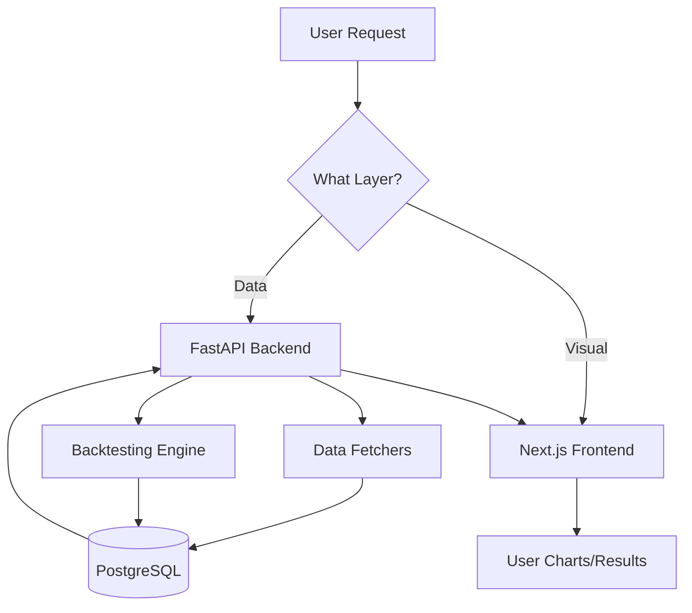

# 🎯 Backtesting Research Tool - Project Root

> **Welcome!** This is the main navigation hub for the entire project documentation.  
> **For AI:** Start with [[_AI_QUICK_START]] for 60-second onboarding.  
> **For Humans:** Read sections below for visual overview.

**Last Updated:** 2024-12-05  
**Project Status:** Active Development  
**Repository:** [GitHub](https://github.com/Casual159/Back-testing-research-tool)

---

## 🎨 Project Vision

Build an **AI-Enhanced Backtesting Research Tool** that combines:
- ✅ **Deterministic Core** - Battle-tested Python code for reliable calculations
- 🔮 **AI Layer** - Natural language interface for strategy exploration and analysis

**Philosophy:** _"AI for Intent, Code for Execution"_

**What This Means:**
- AI suggests strategies and interprets results
- Deterministic code executes trades and calculations
- Human reviews and approves before execution
- No AI black boxes in critical trading logic

---

## 📊 Current Project Status

### ✅ What Works (Production Ready)
- **Data Layer** - Hybrid Binance fetching (bulk + API)
- **Database** - PostgreSQL storage with deduplication
- **Backtesting Engine** - Event-driven, deterministic simulation
- **Indicators** - Technical indicators (SMA, EMA, RSI, MACD, Bollinger, ATR, VWAP)
- **API Backend** - FastAPI with candlestick endpoint
- **Frontend** - Next.js with chart visualization

### 🚧 In Progress
- **Event-driven indicators** - New indicator system
- **Documentation** - This Obsidian knowledge base
- **Auto-generation scripts** - For API/DB docs

### 📋 Planned (Not Started)
- **AI Conversational Interface** - Natural language queries
- **MCP Servers** - Model Context Protocol integration
- **Strategy Builder UI** - Visual strategy composition
- **Advanced Analytics** - Performance attribution, risk metrics

---

## 🗺️ Documentation Map

### For AI Assistants 🤖

**Start Here:**
1. [[_AI_QUICK_START]] - 60-second onboarding (READ THIS FIRST!)
2. [[01-Architecture/_AI_CONTEXT]] - Architecture quick reference
3. [[02-Components/_AI_CONTEXT]] - Component availability and usage
4. [[04-Workflows/_AI_CONTEXT]] - Common development tasks

**Then Navigate By Task:**
- Adding features → [[04-Workflows/_AI_CONTEXT]]
- Understanding code → [[02-Components/_AI_CONTEXT]]
- Checking schemas → [[05-Reference/_GENERATED/README]]
- Reviewing history → [[99-Meta/AI_Session_Notes/]]

---

### For Human Developers 👨‍💻

**Quick Overview:**


**Browse By Category:**

#### 🏗️ [[01-Architecture/|Architecture]]
Understanding how the system is designed
- [[01-Architecture/System Overview|System Overview]] - High-level architecture
- [[01-Architecture/Data Flow|Data Flow]] - How data moves through the system
- [[01-Architecture/Tech Stack|Tech Stack]] - Technology choices and rationale
- [[01-Architecture/Design Decisions|Design Decisions]] - ADRs (Architecture Decision Records)

#### 🧩 [[02-Components/|Components]]
Deep dives into each system component
- [[02-Components/Data Layer|Data Layer]] - BinanceFetcher, PostgresStorage
- [[02-Components/Backtesting Engine|Backtesting Engine]] - Event-driven simulation
- [[02-Components/Indicators|Indicators]] - Technical analysis indicators
- [[02-Components/API Layer|API Layer]] - FastAPI endpoints
- [[02-Components/Frontend|Frontend]] - React components and pages

#### ✨ [[03-Features/|Features]]
User-facing functionality
- [[03-Features/Data Management|Data Management]] - Downloading and managing market data
- [[03-Features/Chart Visualization|Chart Visualization]] - Interactive candlestick charts
- [[03-Features/Backtesting|Backtesting]] - Running strategy backtests (planned)
- [[03-Features/Strategy Builder|Strategy Builder]] - Composing strategies (planned)

#### 🔄 [[04-Workflows/|Workflows]]
How to perform common tasks
- [[04-Workflows/Development Setup|Development Setup]] - Setting up dev environment
- [[04-Workflows/Adding New Indicator|Adding New Indicator]] - Step-by-step guide
- [[04-Workflows/Creating Strategy|Creating Strategy]] - Strategy composition guide
- [[04-Workflows/Troubleshooting|Troubleshooting]] - Common issues and solutions

#### 📚 [[05-Reference/|Reference]]
Technical reference documentation
- [[05-Reference/_GENERATED/README|Auto-Generated Docs]] - Always-current schemas
- [[05-Reference/API Endpoints|API Endpoints]] - HTTP API reference
- [[05-Reference/Database Schema|Database Schema]] - PostgreSQL tables
- [[05-Reference/Configuration|Configuration]] - Environment variables and config

#### 🔬 [[06-Research/|Research]]
Experimental work and ideas
- [[06-Research/Strategy Ideas|Strategy Ideas]] - Trading strategy concepts
- [[06-Research/Indicator Testing|Indicator Testing]] - Indicator validation
- [[06-Research/Performance Analysis|Performance Analysis]] - System performance
- [[06-Research/AI Experiments|AI Experiments]] - AI integration experiments

#### 🧠 [[99-Meta/|Meta]]
Project management and history
- [[99-Meta/TODO|TODO]] - Current task list
- [[99-Meta/AI_Session_Notes/|AI Session Notes]] - AI work history
- [[99-Meta/Human_Notes/|Human Notes]] - Developer notes

---

## 🚀 Quick Start Guides

### For New AI Session
1. Read [[_AI_QUICK_START]]
2. Check latest session: [[99-Meta/AI_Session_Notes/]]
3. Navigate to relevant `_AI_CONTEXT.md` for your task
4. Follow task-specific workflow in [[04-Workflows/]]

### For New Developer
1. Read [[04-Workflows/Development Setup|Development Setup]]
2. Review [[01-Architecture/System Overview|System Overview]]
3. Explore [[02-Components/|Components]] to understand the codebase
4. Check [[99-Meta/TODO|TODO]] for available tasks

### For Strategy Researcher
1. Review [[02-Components/Indicators|Indicators]] for available indicators
2. Check [[06-Research/Strategy Ideas|Strategy Ideas]] for inspiration
3. Learn [[03-Features/Backtesting|Backtesting]] workflow (when available)
4. Document findings in [[06-Research/]]

---

## 🎯 Project Principles

### ✅ DO:
- Keep critical logic in pure Python (deterministic, testable)
- Use AI for fuzzy tasks (NLP, pattern discovery, suggestions)
- Validate all AI outputs with code
- Make AI suggestions transparent
- Fail gracefully with manual fallbacks

### ❌ DON'T:
- Let AI execute trades directly
- Trust AI calculations without validation
- Use AI for time-critical operations
- Ignore AI costs (monitor usage!)
- Build AI-only features (always have manual fallback)

---

## 📁 Repository Structure

```
Back-testing-research-tool/
├── api/                    # FastAPI backend
│   └── main.py            # API endpoints
├── core/                   # Core Python logic (deterministic)
│   ├── data/              # Data fetching and storage
│   ├── backtest/          # Backtesting engine
│   └── indicators/        # Technical indicators
├── frontend/              # Next.js frontend
│   ├── app/               # App router pages
│   └── components/        # React components
├── scripts/               # Utility scripts
├── docs/                  # Legacy documentation
├── Backtesting_Obsidian/  # 👈 THIS DOCUMENTATION
└── tests/                 # Test suite (planned)
```

---

## 🔗 External Resources

### Documentation
- **Original Context:** `../docs/CONTEXT_FOR_NEW_SESSION.md` (legacy, being migrated)
- **GitHub Repo:** [Back-testing-research-tool](https://github.com/Casual159/Back-testing-research-tool)
- **Legacy Project:** [CryptoAnalyzer](https://github.com/Casual159/CryptoAnalyzer) (9 months history)

### APIs & Services
- **Binance Public Data:** [data.binance.vision](https://data.binance.vision/)
- **Binance API Docs:** [API Documentation](https://binance-docs.github.io/apidocs/)
- **PostgreSQL Docs:** [postgresql.org](https://www.postgresql.org/docs/)

### Frameworks & Libraries
- **FastAPI:** [fastapi.tiangolo.com](https://fastapi.tiangolo.com/)
- **Next.js:** [nextjs.org](https://nextjs.org/)
- **Plotly:** [plotly.com/python](https://plotly.com/python/)

---

## 📝 Documentation Philosophy

This documentation follows a **dual-layer approach**:

### 👁️ Human Layer (Top of Documents)
- Visual diagrams (Mermaid, Obsidian Canvas)
- TL;DR summaries
- Examples and screenshots
- High-level concepts

### 🤖 AI Layer (Bottom of Documents)
- Structured data (tables, JSON, code)
- Explicit rules and decision trees
- File locations with line numbers
- Edge cases and gotchas
- Links to related documentation

**Both layers coexist in the same document** - humans read the top, AI reads everything.

---

## 🏁 Where to Go Next?

**Choose your path:**

- 🤖 **I'm an AI assistant** → [[_AI_QUICK_START]]
- 👨‍💻 **I'm a new developer** → [[04-Workflows/Development Setup]]
- 🏗️ **I want to understand architecture** → [[01-Architecture/System Overview]]
- 🔧 **I want to add a feature** → [[04-Workflows/_AI_CONTEXT]]
- 📊 **I want to research strategies** → [[06-Research/Strategy Ideas]]
- 📚 **I want API reference** → [[05-Reference/_GENERATED/README]]

---

**Last Session:** [[99-Meta/AI_Session_Notes/2024-12-05_initial_docs|2024-12-05 - Initial Documentation Setup]]

**Project Status Dashboard:** [[99-Meta/TODO]]

---

_This is a living document. Update as the project evolves._
